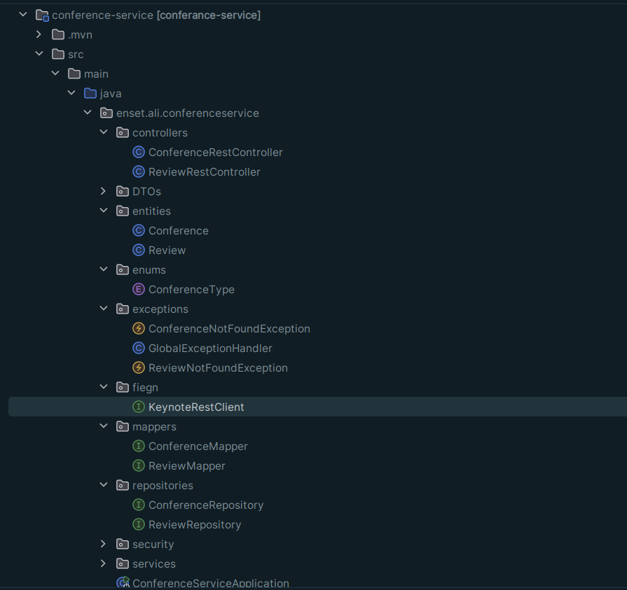

# Conference Management Application

## Realized by : Ali ben-hammad | GLSID 3

## 1. Technical Architecture

The conference management application is built using a microservices architecture. The following microservices are implemented:


1. **Keynote Service**: Manages the keynote speakers, including their id, name, email, and function.
2. **Conference Service**: Manages the conferences, including their id, title, type (academic or commercial), date, duration, number of attendees, and score. It also handles the reviews for each conference, including the review id, date, text, and rating (1-5 stars).
3. **Gateway Service**: Spring Cloud Gateway that serves as the entry point for the application, handling routing, security, and load balancing.
4. **Discovery Service**: Eureka Server or Consul Discovery that enables service discovery and registration.
5. **Config Service**: Spring Cloud Config or Consul Config that manages the centralized configuration for the microservices.
6. **Angular Front-end App**: The web-based user interface built using the Angular framework.

The application also utilizes the following technologies:

- **Security**: OAuth2 and OIDC with Keycloak as the Identity Provider.
- **Fault Tolerance**: Resilience4J for circuit breakers.
- **Documentation**: OpenAPI (Swagger) for the REST API documentation.

---


## 2. Project Setup

The project is set up as a Maven multi-module project with the following modules:

- `keynote-service`
- `conference-service`
- `gateway-service`
- `discovery-service`
- `config-service`
- `angular-front-app`

## 3. Implementing the Discovery and Gateway Services

The `discovery-service` is implemented using  Consul Discovery, which enables service discovery and registration.


The `gateway-service` is implemented using Spring Cloud Gateway, which handles routing, security, and load balancing for the application.

```yaml
spring:
  cloud:
    gateway:
      routes:
        - id: keynote-service
          uri: lb://keynote-service
          predicates:
            - Path=/keynotes/**
          filters:
            - RewritePath=/wallets/(?<remaining>.*), /${remaining}
        - id: conference-service
          uri: lb://conference-service
          predicates:
            - Path=/conferences/**
          filters:
            - RewritePath=/keynotes/(?<remaining>.*), /${remaining}

```

## 4. Implementing the Keynote Service

The `keynote-service` is responsible for managing the keynote speakers. It includes the following components:

- **Entities**: Keynote
- **DAO (Data Access Object)**: KeynoteRepository
- **Service**: KeynoteService
- **DTO (Data Transfer Object)**: KeynoteDTO
- **Mapper**: KeynoteMapper
- **REST Controller**: KeynoteController


## 5. Implementing the Conference Service

The `conference-service` is responsible for managing the conferences and their reviews. It includes the following components:

- **Entities**: Conference, Review
- **DAO (Data Access Object)**: ConferenceRepository, ReviewRepository
- **Service**: ConferenceService, ReviewService
- **DTO (Data Transfer Object)**: ConferenceDTO, ReviewDTO
- **Mapper**: ConferenceMapper, ReviewMapper
- **REST Controller**: ConferenceController
- **Open Feign Client**: KeynoteClient




## 6. Developing the Angular Front-end App

The `angular-front-app` is the web-based user interface for the conference management application. It consumes the REST APIs provided by the `keynote-service` and `conference-service`.


## 7. Securing the Application with Keycloak

The application is secured using OAuth2 and OIDC with Keycloak as the Identity Provider. Users can log in to the application using the Keycloak login form.


